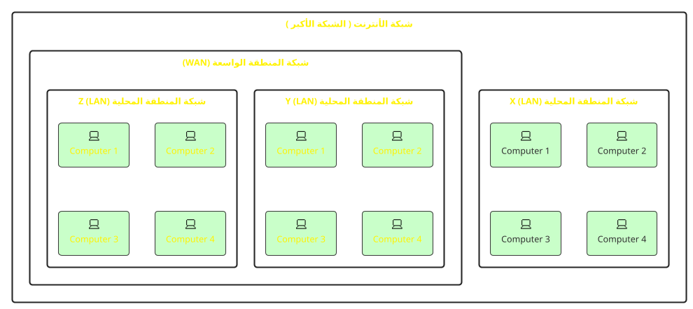
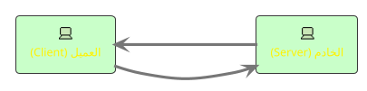
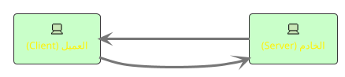

# مرحباً،

كورس اساسيات الويب

<div class="absolute bottom-10">
  <span class="font-700">
    حسن الخالدي
  </span>
</div>

---
layout: statement
preload: false
---

<div
v-motion
  :initial="{ opacity: 0, left: '50%', }"
  :enter="{ 
    opacity: 1,
    left: '75%',
    transition: {
      duration: 1750,
    },
  }"
 style="margin: 0; position: absolute; top: 50%; left: 50%; transform: translate(-50%, -50%);"
  class="font-700 text-[20rem] text-[#262626] opacity-40">
1
</div>

<h1
  v-motion
  :initial="{ opacity: 0, scale: 1 }"
  :enter="{ 
    opacity: 1,
    scale: 1.3,
    transition: {
      duration: 1750,
    },
  }" class="z-10">
ماهو الأنترنت؟
</h1>
---

# ماهو الأنترنت؟


<br />

## أهداف التعلم

<v-clicks>

- معرفة ماهو الأنترنت
- شرح الفرق بين الأنترنت والويب
- معرفة المكونات الرئيسية للأنترنت
- معرفة أنواع البروتوكولات
- معرفة بروتوكول HTTP
  - معرفة ماهي لغة HTML
  - معرفة ماهي لغة CSS
  - معرفة ماهي لغة برمجة JavaScript

</v-clicks>


---

# تعريف الانترنت

<br />

<div class="grid grid-cols-2 items-start gap-10">
  <div>
  الانترنت هو شبكة عالمية من الحاسبات التي تربط الناس والأجهزة في جميع أنحاء العالم.

  هو شبكة من الشبكات، ويتكون من ملايين من الشبكات الأصغر، وتسمى LANs (شبكات المنطقة المحلية) و WANs (شبكات المنطقة الواسعة).

  الانترنت هو مجموعة من هذه الشبكات، وهو ما يسمح لك بالاتصال بالويب.
  </div>

  <div class="flex justify-start items-start w-full">
<Group class="-mt-16" :tabs="['LAN', 'WAN', 'INTERNET']">
  <template #tab-1>
```plantuml
!theme black-knight
skinparam DefaultFontName system-ui

rectangle "شبكة المنطقة المحلية (LAN)" {
    archimate #Technology "Computer 1" <<device>>
    archimate #Technology "Computer 2" <<device>>
    archimate #Technology "Computer 3" <<device>>
    archimate #Technology "Computer X" <<device>>
}
```
  </template>

  <template #tab-2>
```plantuml
!theme black-knight
skinparam DefaultFontName system-ui
rectangle "شبكة المنطقة الواسعة (WAN)" {
  rectangle "شبكة المنطقة المحلية (LAN)" {
    archimate #Technology "Computer 1" as S2C1 <<device>>
    archimate #Technology "Computer 2" as S2C2 <<device>>
    archimate #Technology "Computer 3" as S2C3 <<device>>
    archimate #Technology "Computer X" as S2C4 <<device>>
  }
  rectangle "شبكة المنطقة المحلية (LAN) X" {
    archimate #Technology "Computer 1" as S2C5 <<device>>
    archimate #Technology "Computer 2" as S2C6 <<device>>
    archimate #Technology "Computer 3" as S2C7 <<device>>
    archimate #Technology "Computer X" as S2C8 <<device>>
  }
}
```
  </template>

  <template #tab-3>
    

  </template>
</Group>

  </div>
</div>


---
layout: image-right
image: 'internet.jpg'
---

# ماهو الفرق بين الانترنت والويب؟

<br />

<Badge class="text-blue-300">الأنترنت</Badge> هو الشبكة العالمية.

اما <Badge class="text-yellow-300">الويب</Badge> هو مجموعة من المواقع.

<br />

أي ان الأنترنت هو شبكة من الحاسبات التي تربط الناس والأجهزة في جميع أنحاء العالم. 

 وهو ما يسمح لك بالاتصال بالويب.

---

# مكونات الانترنت

<br />

## **1. الخادم (Server)**

<div class="grid grid-cols-2 items-start gap-10">
  <div>
  
  هو حاسوب يخزن المعلومات ويجعلها متاحة للحواسب الأخرى على الانترنت.

  وهي عادة متصلة بالانترنت 24/7، وعادة موجودة في مراكز البيانات (Data Centers).

```plantuml
@startuml
!theme black-knight
skinparam DefaultFontName system-ui
archimate #Technology "(Server) الخادم" <<technology-device>>
@enduml
```

  </div>

  <div class="flex justify-start items-start w-full">

  </div>
</div>
---

# مكونات الانترنت

<br />

## **2. العملاء (Clients)**

<div class="grid grid-cols-2 items-start gap-10">
  <div>
  
هو الحاسوب الذي يستخدمه المستخدم للوصول إلى المعلومات على الانترنت.

وهو يستخدم برامج مثل متصفحات الويب

  </div>

  <div class="flex justify-start items-start w-full">


  </div>
</div>

---

# مكونات الانترنت

<br />

## **3. البروتوكولات (Protocols)**


<div class="grid grid-cols-2 items-start gap-10">
  <div>
  
في لغة الشبكات، يمكن تعريف البروتوكولات على أنها مجموعة من القواعد التي تهدف إلى توجيه نقل البيانات بين أجهزة الحوسبة.

تضم هذه القواعد التأكد من أن طلب البيانات يتم إرساله واستلامه من قبل العميل دون أي مشكلة.

  </div>

  <div class="flex justify-start items-start w-full">


  </div>
</div>

---

# أنواع البروتوكولات

<br />

<v-clicks>

- <Badge class="ml-1">بروتوكول التحكم بالنقل (TCP)</Badge>
  للتواصل عبر الشبكة.
- <Badge class="ml-1">بروتوكول الانترنت (IP)</Badge>
  بروتوكول الاتصال بالانترنت (يسمع بالاتصال بين الشبكات المختلفة).
- <Badge class="ml-1">بروتوكول حزم بيانات المستخدم (UDP)</Badge>
  بروتوكول الاتصال البديل.
- <Badge class="ml-1">بروتوكول مكتب البريد (POP)</Badge>
  لاستلام رسائل البريد الإلكتروني الواردة.
- <Badge class="ml-1">بروتوكول نقل البريد البسيط (SMTP)</Badge>
  مصمم لإرسال وتوزيع البريد الإلكتروني الصادر.
- <Badge class="ml-1">بروتوكول نقل الملفات (FTP)</Badge>
  لنقل الملفات من جهاز إلى آخر.
- <Badge class="ml-1 text-yellow-400">بروتوكول نقل النص التشعبي (HTTP)</Badge>
  مصمم لنقل نص تشعبي بين نظامين أو أكثر.
- <Badge class="ml-1 text-yellow-400">بروتوكول نقل النص التشعبي الآمن (HTTPS)</Badge>
  مشابه لبروتوكول نقل النص التشعبي إلا إن البيانات تكون مشفرة.
- <Badge class="ml-1">تل نت (Telnet)</Badge>
  يستخدم لتسجيل الدخول إلى حاسوب يستعمل عن بعد بروتوكول TCP/IP.
- <Badge class="ml-1">غوفر (Gopher)</Badge>
  يسمح بتوزيع المستندات والوثائق والبحث عنها واسترجاعها

</v-clicks>

<!-- ## هناك بروتوكولات أخرى أيضًا ، لكن هذه هي الأكثر أهمية. -->

---

# بروتوكول نقل النص التشعبي (HTTP)

<br />

بروتوكول النص التشعبي هو بروتوكول لجلب الموارد مثل مستندات HTML.

إنه أساس أي تبادل بيانات على الويب وهو بروتوكول عميل-خادم، مما يعني أن الطلبات تبدأ من قبل المستلم، عادة ما يكون متصفح الويب.

يتم إعادة تجميع المستند الكامل من المستندات الفرعية، على سبيل المثال، النصوص والصور والفيديوهات وغيرها.


---

# لغة HTML

<br />

هي ليست لغة برمجية بالمعنى المتعارف عليه للغات البرمجة.
ولكنها لغة أو طريقة لوصف محتويات صفحة الويب لبرامج التصفح، حيث أن أي برنامج متصفح انترنت يحتاج لمعرفة محتويات الصفحة من عناوين ونصوص وصور وروابط و غير ذلك من مكونات صفحة الويب، حتى تتمكن من عرضها بالشكل الصحيح، ولغة الترميز HTML،

هي اللغة الرئيسية التي يتكون منها أي موقع أو صفحة على شبكة الإنترنت.

```html {all|1|2,10|3,5|4|7,9|8|all}
<!DOCTYPE html>
<html>
  <head>
    <title>My First Website</title>
  </head>

  <body>
    <h1 style="color: red">Hello World!</h1>
  </body>
</html>
```

---

# لغة CSS

<br />

لغة CSS هي لغة تنسيقية تُستخدم في تنسيق مستندات وملفات مكتوبة بصيغة معينة أو هيكلية.

الغرض الرئيسي من لغة CSS هو تمكين الفصل بين كود المحتوى (HTML) وكود العرض (CSS)،
بما في ذلك التخطيط والألوان والخطوط.


<div class="grid grid-cols-2 items-center justify-center gap-10">
<v-clicks>
  <div>

  ```css
  h1 {
    color: red;
  }
  ```

  </div>
  <div class="border border-[#262626] rounded p-1" dir="ltr">
    <h1 style="color: red">
      Hello World!  
    </h1>
  </div>

  <div>

  ```css
  h1 {
    color: green;
    font-size: 4rem; /* 64px */
    font-family: serif;
  }
  ```

  </div>
  <div class="border border-[#262626] rounded px-1 py-3.5" dir="ltr">
    <h1 style="color: green; font-size: 4rem; font-family: serif;">
      Hello World!  
    </h1>
  </div>
</v-clicks>
</div>


---

# لغة JavaScript

<br />

هي لغة برمجية عالية المستوى تستخدم أساساً في متصفحات الويب ولها استخدامات واسعة أخرى في المجالات الأخرى , تضيف اساساً تفاعلية عالية الى صفحة الويب.


<div class="grid grid-cols-2 items-center justify-center gap-10">
<v-clicks>
  <div>

```html
<!-- HTML -->
<button onclick="myFunction()">Click me!</button>
```
```js
// JavaScript
function myFunction() {
  alert("Hello World!");
}
```

  </div>
  <div class="flex justify-center border border-[#262626] rounded px-1 py-16" dir="ltr">
    <TempJS />
  </div>


</v-clicks>
</div>

---
layout: intro
class: text-center
---

<div class="grid grid-cols-2 items-center justify-center gap-10">
  <div>

# شكرًا لكم
فريق النخبة البرمجي

  </div>
  <div>
    <HandWave class="font-700 text-[15rem] text-[#262626]" />
  </div>
</div>


<!-- style="margin: 0; position: absolute; top: 30%; left: 50%; transform: translate(-50%, -50%);" -->