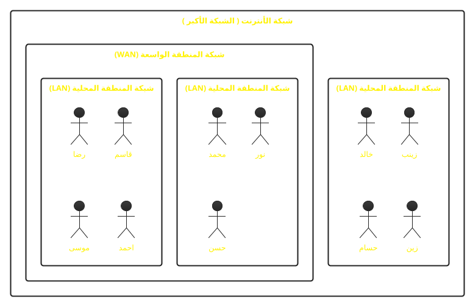

# مرحباً،

كورس اساسيات الويب

<div class="absolute bottom-10">
  <span class="font-700">
    حسن الخالدي
  </span>
</div>

---
layout: statement
preload: false
---

<h1
  v-motion
  :initial="{ opacity: 0, scale: 1 }"
  :enter="{ 
    opacity: 1,
    scale: 1.3,
    transition: {
      duration: 1750,
    },
  }">
ماهو الأنترنت؟
</h1>

---

# ماهو الأنترنت؟

<br />

## أهداف التعلم

- معرفة ماهو الأنترنت
- شرح الفرق بين الأنترنت والويب
- معرفة المكونات الرئيسية للأنترنت
- معرفة أنواع البروتوكولات
- معرفة بروتوكول HTTP
  - معرفة ماهي لغة HTML
  - معرفة ماهي لغة CSS
  - معرفة ماهي لغة برمجة JavaScript

---

# تعريف الانترنت

<br />

<div class="grid grid-cols-2 items-start gap-10">
  <div>
  الانترنت هو شبكة عالمية من الحاسبات التي تربط الناس والأجهزة في جميع أنحاء العالم.

  هو شبكة من الشبكات، ويتكون من ملايين من الشبكات الأصغر، وتسمى LANs (شبكات المنطقة المحلية) و WANs (شبكات المنطقة الواسعة).

  الانترنت هو مجموعة من هذه الشبكات، وهو ما يسمح لك بالاتصال بالويب.
  </div>

  <div class="flex justify-start items-start w-full">
<Group class="-mt-16" :tabs="['LAN', 'WAN', 'INTERNET']">
  <template #tab-1>
```plantuml
!theme black-knight
skinparam DefaultFontName system-ui
rectangle "شبكة المنطقة المحلية (LAN)" {
    "خالد"
    "زينب"
    "حسام"
    "زين"
}
```
  </template>

  <template #tab-2>
```plantuml
!theme black-knight
skinparam DefaultFontName system-ui
rectangle "شبكة المنطقة الواسعة (WAN)" {
  rectangle "شبكة المنطقة المحلية (LAN)" {
    "خالد"
    "زينب"
    "حسام"
    "زين"
  }
  rectangle "شبكة المنطقة المحلية (LAN) 2" {
    "محمد"
    "عبدالله"
    "سارة"
    "محمود"
  }
}
```
  </template>

  <template #tab-3>
    

  </template>
</Group>

  </div>
</div>


---
layout: image-right
image: 'internet.jpg'
---

# ماهو الفرق بين الانترنت والويب؟

<br />

<Badge class="text-blue-300">الأنترنت</Badge> هو الشبكة العالمية.

اما <Badge class="text-yellow-300">الويب</Badge> هو مجموعة من المواقع.

<br />

أي ان الأنترنت هو شبكة من الحاسبات التي تربط الناس والأجهزة في جميع أنحاء العالم.
وهو شبكة من الشبكات، ويتكون من ملايين من الشبكات الأصغر، وتسمى LANs (شبكات المنطقة المحلية) و WANs (شبكات المنطقة الواسعة). الانترنت هو مجموعة من هذه الشبكات، وهو ما يسمح لك بالاتصال بالويب.

---

layout: image-right
image: 'internet.jpg'

---

# مكونات الانترنت

<br />

## **1. الخادم (Server)**

هو حاسوب يخزن المعلومات ويجعلها متاحة للحواسب الأخرى على الانترنت.

وهي عادة متصلة بالانترنت 24/7، وعادة موجودة في مراكز البيانات (Data Centers).

---

layout: image-right
image: 'internet.jpg'

---

# مكونات الانترنت

<br />

## **2. العملاء (Clients)**

هو الحاسوب الذي يستخدمه المستخدم للوصول إلى المعلومات على الانترنت.

وهو يستخدم برامج مثل متصفحات الويب مثل:

- Chrome
- Firefox
- Safari
- Edge

---

layout: image-right
image: 'internet.jpg'

---

# مكونات الانترنت

<br />

## **3. البروتوكولات (Protocols)**

في لغة الشبكات، يمكن تعريف البروتوكولات على أنها مجموعة من القواعد التي تهدف إلى توجيه نقل البيانات بين أجهزة الحوسبة.

تضم هذه القواعد التأكد من أن طلب البيانات يتم إرساله واستلامه من قبل العميل دون أي مشكلة.

---

## image: 'internet.jpg'

# أنواع البروتوكولات

<br />

- بروتوكول التحكم بالنقل (TCP)
  للتواصل عبر الشبكة
- بروتوكول الانترنت (IP)
  بروتوكول الاتصال بالانترنت (يسمع بالاتصال بين الشبكات المختلفة)
- بروتوكول حزم بيانات المستخدم (UDP)
  بروتوكول الاتصال البديل
- بروتوكول مكتب البريد (POP)
  لاستلام رسائل البريد الإلكتروني الواردة
- بروتوكول نقل البريد البسيط (SMTP)
  مصمم لإرسال وتوزيع البريد الإلكتروني الصادر
- بروتوكول نقل الملفات (FTP)
  لنقل الملفات من جهاز إلى آخر
- بروتوكول نقل النص التشعبي (HTTP)
  مصمم لنقل نص تشعبي بين نظامين أو أكثر
- بروتوكول نقل النص التشعبي الآمن (HTTPS)
  مشابه لبروتوكول نقل النص التشعبي إلا إن البيانات تكون مشفرة
- تل نت (Telnet)
  يستخدم لتسجيل الدخول إلى حاسوب يستعمل عن بعد بروتوكول TCP/IP
- غوفر (Gopher)
  يسمح بتوزيع المستندات والوثائق والبحث عنها واسترجاعها

## هناك بروتوكولات أخرى أيضًا ، لكن هذه هي الأكثر أهمية.

layout: image-right
image: 'internet.jpg'

---

# بروتوكول نقل النص التشعبي (HTTP)

<br />

بروتوكول النص التشعبي هو بروتوكول لجلب الموارد مثل مستندات HTML.

إنه أساس أي تبادل بيانات على الويب وهو بروتوكول عميل-خادم، مما يعني أن الطلبات تبدأ من قبل المستلم، عادة ما يكون متصفح الويب.

## يتم إعادة تجميع المستند الكامل من المستندات الفرعية، على سبيل المثال، النصوص والصور والفيديوهات وغيرها.

# لغة HTML

<br />

هي ليست لغة برمجية بالمعنى المتعارف عليه للغات البرمجة.
ولكنها لغة أو طريقة لوصف محتويات صفحة الويب لبرامج التصفح، حيث أن أي برنامج متصفح انترنت يحتاج لمعرفة محتويات الصفحة من عناوين ونصوص وصور وروابط و غير ذلك من مكونات صفحة الويب، حتى تتمكن من عرضها بالشكل الصحيح، ولغة الترميز HTML،

هي اللغة الرئيسية التي يتكون منها أي موقع أو صفحة على شبكة الإنترنت.

```html {all|1|2,10|3,5|4|7,9|8|all}
<!DOCTYPE html>
<html>
  <head>
    <title>My First Website</title>
  </head>

  <body>
    <h1 style="color: red">Hello World!</h1>
  </body>
</html>
```

---

# لغة CSS

<br />

لغة CSS هي لغة تنسيقية تُستخدم في تنسيق مستندات وملفات مكتوبة بصيغة معينة أو هيكلية.

الغرض الرئيسي من لغة CSS هو تمكين الفصل بين كود المحتوى (HTML) وكود العرض (CSS)،
بما في ذلك التخطيط والألوان والخطوط.

```css {all|1,3|2|all}
h1 {
  color: red;
}
```

---

# لغة JavaScript

<br />

هي لغة برمجية عالية المستوى تستخدم أساساً في متصفحات الويب ولها استخدامات واسعة أخرى في المجالات الأخرى , تضيف اساساً تفاعلية عالية الى صفحة الويب.

```js
const title = "Hello World!";
```

---

layout: center
class: text-center

---

# شكرًا لكم
